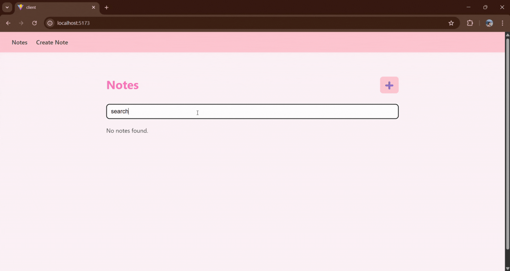
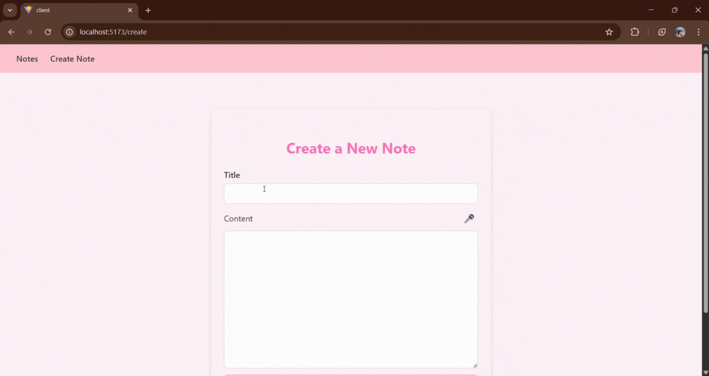

# Notes – End-to-End Web Development Reflection

## Project Goal

This project is a personal reflection and hands-on exercise to strengthen my understanding of **end-to-end web development**. The goal was to build a complete notes application, starting from the **database**, to the **backend API**, and finally to a fully interactive **frontend**, with future plans to explore AI-powered features.

This first iteration consolidates my understanding of full-stack development, including:
* Database design
* Backend CRUD APIs
* Frontend React integration
* UI styling

## Overview
**AI Notes** is a simple note-taking application built with the following stack:
* **Database:** SQLite3
* **Backend:** Node.js with Express
* **Frontend:** React with Vite, styled with CSS modules
**Goal:** Understand the full flow of data from frontend to backend to database and reflect on React, full-stack, and AI concepts.


## Second Iteration
### Demo
#### Search


While implementing search, I realized that in the backend, route order matters. Having `notes/:id` before `notes/search` caused requests for search to be incorrectly routed. I debugged this using console logs and AI assistance, and learned that the order of route definitions is important in Express.

I still don't have use for `notes/:id` so removed taht for now.

I plan to implenent semantic search next.

#### Speech to Text

It’s been fun reading about the [Web Speech API](https://developer.mozilla.org/en-US/docs/Web/API/Web_Speech_API). I’m glad we already have this available, it’s easy to integrate, so I don’t have to build speech recognition from scratch.

It works by:
- Receiving audio input from the user's microphone
- Processing the audio by a speech recognition service
- Returning the recognized text

This iteration adds speech-to-text functionality to the notes app, enabling users to dictate notes directly in the frontend.

### Backend (`server`)
- Add search by title or content

### Frontend (`client`)
- Support search and transcription ui
- Use Create Icon instead of a Text button

## First Iteration
### Demo


### Backend (`server`)
* **CRUD operations implemented:**
  * Create notes
  * Fetch all notes
  * Fetch note by ID
  * Update notes
  * Soft delete notes
* **Schema:** Notes table with fields: `id`, `title`, `content`, `created_at`, `updated_at`, `deleted_at`

### Frontend (`client`)
* **Pages:**
  * **Notes List Page:** Displays all notes in a card layout
  * **Create Note Page:** Form to create new notes
* **Styling:** Baby-pink theme using CSS modules (I plan to improve this soon)
* **Responsive layout** for mobile and desktop

**Note:** This first iteration, including the backend, database schema, and frontend pages, was completed in **1–2 hours** as a rapid prototype and learning exercise.

## Future Iterations
* **Extend functionality:**
  * Integrate **speech-to-text** for note creation
  * Add **semantic search** for smarter note retrieval

* **AI knowledge reflection:**
  * Experiment with embedding AI features while maintaining the E2E stack

* **Frontend improvements:**
  * Edit and delete notes directly from the UI
  * More polished UX and responsive design


## How to Run
### Backend
```bash
cd server
npx nodemon server.js
```

### Frontend
```bash
cd client
npm install
npm run dev
```

